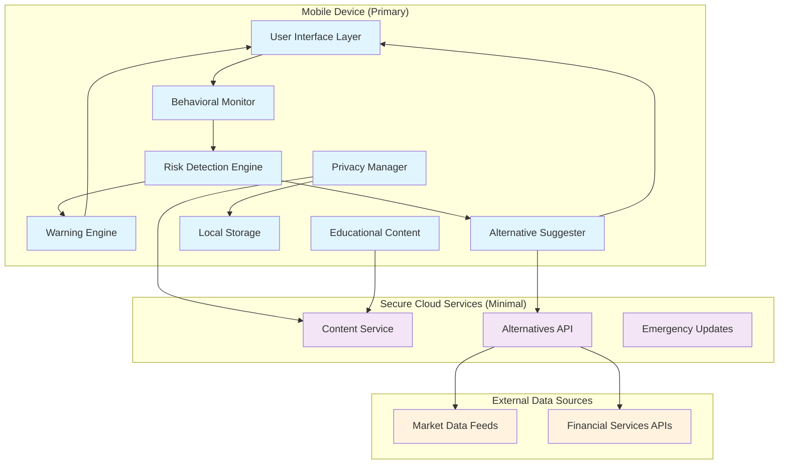

# Design Document: Guard AI

## Overview

Guard AI is a privacy-first financial protection system designed specifically for Indian youth aged 18-30. The system employs behavioral pattern detection and machine learning to silently monitor user activities, identify risky financial intentions, and provide timely interventions through private warnings and educational content.

The architecture follows a client-centric approach with minimal cloud dependency to ensure maximum privacy. The system operates as a mobile application with local processing capabilities, using encrypted communication only when necessary for updates and alternative recommendations.

## Architecture

### High-Level Architecture



### Component Architecture

The system is built using a modular architecture with clear separation of concerns:

1. **Behavioral Monitor**: Continuously observes user interactions and app usage patterns
2. **Risk Detection Engine**: Analyzes behavioral data using machine learning models
3. **Warning Engine**: Generates and delivers contextual warnings
4. **Alternative Suggester**: Recommends safer financial options
5. **Privacy Manager**: Handles all data encryption and privacy controls
6. **Educational Content**: Delivers financial literacy content

## Components and Interfaces

### Behavioral Monitor

**Purpose**: Silently tracks user behavior patterns to identify potential risky financial activities.

**Key Functions**:
- App usage monitoring (time spent on trading/betting apps)
- Search query analysis (keywords related to quick money, trading, betting)
- Website visit tracking (high-risk financial platforms)
- Transaction pattern analysis (frequency, amounts, timing)
- Device behavior analysis (app installations, deletions)

**Interface**:
```typescript
interface BehavioralMonitor {
  startMonitoring(): void;
  stopMonitoring(): void;
  getBehaviorProfile(): BehaviorProfile;
  detectRiskyPatterns(): RiskIndicator[];
}

interface BehaviorProfile {
  userId: string;
  appUsagePatterns: AppUsage[];
  searchPatterns: SearchQuery[];
  transactionPatterns: TransactionData[];
  riskScore: number;
  lastUpdated: Date;
}
```

### Risk Detection Engine

**Purpose**: Analyzes behavioral data using machine learning models to identify risky financial intentions.

**Key Algorithms**:
- Isolation Forest for anomaly detection in spending patterns
- Random Forest classifier for risk categorization
- LSTM networks for temporal pattern analysis
- Rule-based systems for immediate high-risk detection

**Interface**:
```typescript
interface RiskDetectionEngine {
  analyzeRisk(profile: BehaviorProfile): RiskAssessment;
  updateModels(newData: TrainingData[]): void;
  getRiskThresholds(): RiskThresholds;
}

interface RiskAssessment {
  riskLevel: 'LOW' | 'MEDIUM' | 'HIGH' | 'CRITICAL';
  riskFactors: RiskFactor[];
  confidence: number;
  recommendedActions: string[];
}
```

### Warning Engine

**Purpose**: Generates contextual, non-judgmental warnings and delivers them privately to users.

**Key Features**:
- Personalized warning messages based on risk type
- Cultural sensitivity for Indian context
- Dismissal tracking to avoid warning fatigue
- Emergency intervention capabilities

**Interface**:
```typescript
interface WarningEngine {
  generateWarning(risk: RiskAssessment): Warning;
  deliverWarning(warning: Warning): DeliveryResult;
  trackDismissal(warningId: string): void;
  shouldShowWarning(riskType: string): boolean;
}

interface Warning {
  id: string;
  type: WarningType;
  severity: 'INFO' | 'WARNING' | 'CRITICAL';
  message: string;
  potentialLoss: LossCalculation;
  alternatives: Alternative[];
  educationalContent: string[];
}
```

### Alternative Suggester

**Purpose**: Recommends safer financial options tailored to Indian markets and user profiles.

**Key Features**:
- Integration with Indian financial services (mutual funds, fixed deposits, etc.)
- Risk-appropriate recommendations based on user income
- Real-time market data for accurate projections
- Cultural and regulatory compliance for Indian context

**Interface**:
```typescript
interface AlternativeSuggester {
  getSaferAlternatives(userProfile: UserProfile, riskType: string): Alternative[];
  calculateExpectedReturns(alternative: Alternative): ReturnProjection;
  updateMarketData(): void;
}

interface Alternative {
  id: string;
  name: string;
  type: 'SAVINGS' | 'MUTUAL_FUND' | 'FD' | 'BONDS' | 'SIP';
  expectedReturn: number;
  riskLevel: number;
  minimumInvestment: number;
  timeHorizon: string;
  provider: string;
  regulatoryInfo: string;
}
```

### Privacy Manager

**Purpose**: Ensures complete user privacy through encryption, local storage, and minimal data transmission.

**Key Features**:
- AES-256 encryption for all sensitive data
- Local-first data storage approach
- Secure key management using device keystore
- Data anonymization for any cloud interactions
- Complete data deletion capabilities

**Interface**:
```typescript
interface PrivacyManager {
  encryptData(data: any): EncryptedData;
  decryptData(encryptedData: EncryptedData): any;
  storeLocally(key: string, data: any): void;
  retrieveLocally(key: string): any;
  deleteAllData(): void;
  anonymizeForCloud(data: any): AnonymizedData;
}
```

## Data Models

### User Profile
```typescript
interface UserProfile {
  id: string;
  age: number;
  monthlyIncome: number;
  expenses: MonthlyExpenses;
  financialGoals: FinancialGoal[];
  riskTolerance: 'CONSERVATIVE' | 'MODERATE' | 'AGGRESSIVE';
  preferredLanguage: 'ENGLISH' | 'HINDI';
  createdAt: Date;
  lastActive: Date;
}

interface MonthlyExpenses {
  housing: number;
  food: number;
  transportation: number;
  entertainment: number;
  other: number;
}

interface FinancialGoal {
  type: 'EMERGENCY_FUND' | 'INVESTMENT' | 'SAVINGS' | 'EDUCATION';
  targetAmount: number;
  timeframe: number; // months
  priority: 'HIGH' | 'MEDIUM' | 'LOW';
}
```

### Risk Indicators
```typescript
interface RiskIndicator {
  type: 'APP_USAGE' | 'SEARCH_PATTERN' | 'TRANSACTION' | 'WEBSITE_VISIT';
  severity: number; // 1-10 scale
  description: string;
  detectedAt: Date;
  metadata: Record<string, any>;
}

interface RiskFactor {
  category: 'TRADING_APPS' | 'BETTING_PLATFORMS' | 'LOAN_APPS' | 'SCAM_SITES';
  weight: number;
  evidence: string[];
  confidence: number;
}
```

### Loss Calculation
```typescript
interface LossCalculation {
  bestCase: number;
  worstCase: number;
  mostLikely: number;
  timeframe: string;
  assumptions: string[];
  comparisonWithSaferOptions: number;
}
```

Now I need to use the prework tool to analyze the acceptance criteria before writing the Correctness Properties section.

## Correctness Properties

*A property is a characteristic or behavior that should hold true across all valid executions of a system—essentially, a formal statement about what the system should do. Properties serve as the bridge between human-readable specifications and machine-verifiable correctness guarantees.*

### Property 1: Risk Pattern Recognition
*For any* user search query or website visit containing trading, betting, or quick-money keywords, the Risk_Detector should correctly identify it as risky financial intention and log it for analysis
**Validates: Requirements 1.1, 1.2, 1.3**

### Property 2: System Performance and Responsiveness  
*For any* detected risky financial intention, the system should analyze the risk within 5 seconds and deliver warnings within 10 seconds
**Validates: Requirements 1.4, 2.1**

### Property 3: Continuous Operation
*For any* system state or user interaction, the Risk_Detector should remain active and operational without requiring manual activation
**Validates: Requirements 1.5**

### Property 4: Warning Privacy and Customization
*For any* warning delivered to a user, it should be visible only to that user and customized based on the specific risk type detected
**Validates: Requirements 2.2, 2.4**

### Property 5: Warning Dismissal Respect
*For any* warning dismissed by a user, the same warning should not reappear for the same risk type within 24 hours
**Validates: Requirements 2.3**

### Property 6: Loss Calculation Completeness
*For any* risk scenario and user profile, the system should calculate and display both best-case and worst-case financial loss scenarios
**Validates: Requirements 3.1, 3.2**

### Property 7: Demographic Fallback for Incomplete Data
*For any* user profile with missing income data, the system should use appropriate demographic averages for Indian youth in loss calculations and recommendations
**Validates: Requirements 3.3**

### Property 8: Real-time Loss Updates
*For any* change in user behavior or risk profile, loss calculations should be updated in real-time to reflect the new risk level
**Validates: Requirements 3.4**

### Property 9: Alternative Suggestion Completeness
*For any* detected risky behavior, the system should provide at least 3 safer financial alternatives, each including expected returns, time horizons, and regulatory compliance information
**Validates: Requirements 4.1, 4.3, 4.4**

### Property 10: Risk-Appropriate Alternative Matching
*For any* user profile and detected risk, suggested alternatives should match the user's risk tolerance, financial goals, and income level (prioritizing savings for income below ₹50,000/month)
**Validates: Requirements 4.2, 4.5**

### Property 11: Comprehensive Data Privacy Protection
*For any* user financial data stored or transmitted, it should be encrypted using AES-256, stored primarily locally, and use end-to-end encryption for any necessary transmission
**Validates: Requirements 5.1, 5.2, 5.3**

### Property 12: Complete Data Control and Hiding
*For any* user request for data deletion or device access by others, the system should provide complete data removal capabilities and ensure Guard AI data remains hidden from unauthorized access
**Validates: Requirements 5.4, 5.5**

### Property 13: Graceful Onboarding with Incomplete Data
*For any* user registration with incomplete financial information, the system should function with available data while requesting additional details over time
**Validates: Requirements 6.3**

### Property 14: Rapid Setup and Immediate Activation
*For any* new user completing setup, the process should complete within 5 minutes and immediately begin risk monitoring
**Validates: Requirements 6.4, 6.5**

### Property 15: Contextual Educational Content Delivery
*For any* detected risky behavior, the system should provide relevant financial education content and track user engagement for future improvements
**Validates: Requirements 7.1, 7.4**

### Property 16: Content Freshness and Language Support
*For any* educational content in the system, it should be updated weekly with current trends and be available in both English and Hindi
**Validates: Requirements 7.3, 7.5**

### Property 17: Emergency Intervention Escalation
*For any* extremely high-risk behavior detected, the system should trigger emergency mode with prominent, non-dismissible warnings and offer direct counselor contact
**Validates: Requirements 8.1, 8.2, 8.3**

### Property 18: Cooling-off Period Enforcement
*For any* user attempting to proceed despite emergency warnings, the system should enforce a 24-hour cooling-off period before allowing the action
**Validates: Requirements 8.4**

### Property 19: Emergency Mode State Management
*For any* emergency situation that becomes resolved, the system should automatically return to normal monitoring mode
**Validates: Requirements 8.5**

## Error Handling

### Risk Detection Errors
- **False Positives**: Implement confidence thresholds and user feedback mechanisms to reduce incorrect risk identification
- **Model Degradation**: Regular model retraining with new data to maintain accuracy
- **Performance Degradation**: Fallback to rule-based detection if ML models fail

### Privacy and Security Errors
- **Encryption Failures**: Graceful degradation to local-only mode if encryption fails
- **Data Corruption**: Regular data integrity checks and backup mechanisms
- **Unauthorized Access**: Immediate data lockdown and user notification

### System Availability Errors
- **Network Failures**: Full offline functionality for core protection features
- **Storage Failures**: Graceful degradation with reduced functionality
- **Battery Optimization**: Efficient background processing to minimize battery drain

### User Experience Errors
- **Warning Fatigue**: Intelligent warning frequency management and user preference learning
- **Language Barriers**: Automatic language detection and appropriate content delivery
- **Cultural Sensitivity**: Regular content review and user feedback integration

## Testing Strategy

### Dual Testing Approach

The testing strategy employs both unit testing and property-based testing to ensure comprehensive coverage:

**Unit Tests**: Focus on specific examples, edge cases, and error conditions including:
- Specific risk detection scenarios (e.g., user searches for "quick money trading apps")
- Integration points between components (Risk Detector → Warning Engine)
- Edge cases like incomplete user profiles or network failures
- Error conditions such as encryption failures or storage issues

**Property-Based Tests**: Verify universal properties across all inputs including:
- Risk detection accuracy across thousands of generated search queries and behavioral patterns
- Warning delivery performance under various system loads
- Privacy protection across different data types and access scenarios
- Alternative suggestion appropriateness for diverse user profiles

### Property-Based Testing Configuration

- **Testing Library**: Use fast-check for JavaScript/TypeScript implementation
- **Test Iterations**: Minimum 100 iterations per property test to ensure statistical significance
- **Test Tagging**: Each property test must include a comment referencing its design document property
- **Tag Format**: `// Feature: guard-ai, Property {number}: {property_text}`

### Testing Requirements

Each correctness property must be implemented by a single property-based test that:
1. Generates appropriate random inputs for the property domain
2. Executes the system behavior being tested
3. Verifies the property holds for all generated inputs
4. Reports any counterexamples that violate the property

The combination of unit tests and property tests provides comprehensive coverage where unit tests catch concrete bugs and property tests verify general correctness across the input space.